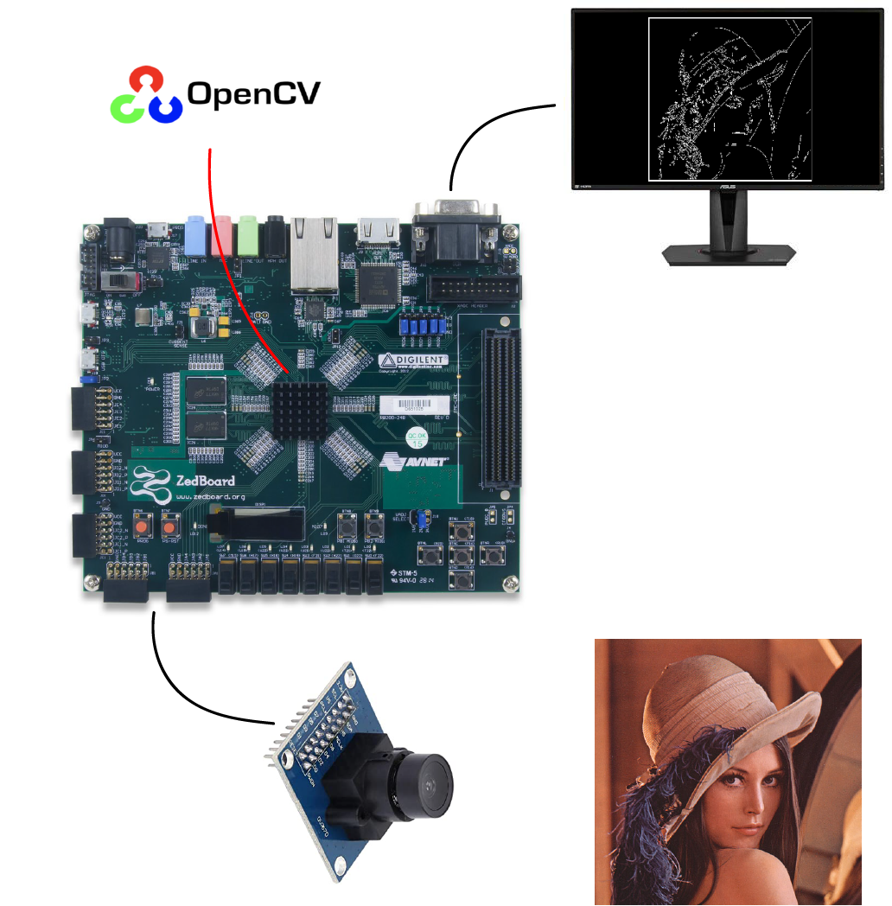
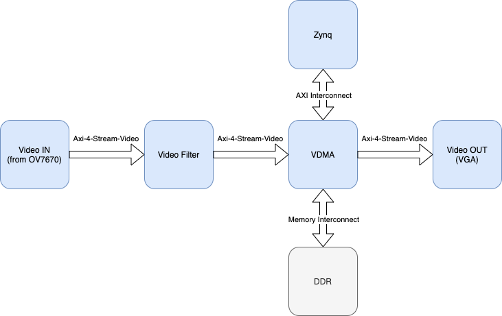
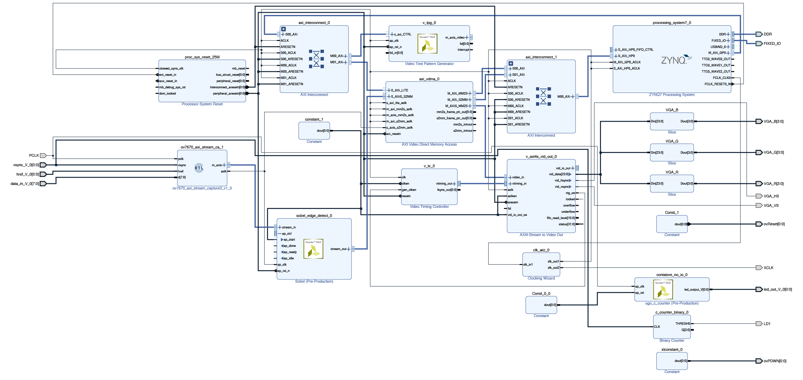

# ZedBoard Image Processing Pipeline
This is an FPGA based image processing pipeline. It was implemented using a zedboard and is capable of accelerating (or directly implementing) many openCV functions.

## Introduction

This platform makes the creation and the use of basic video filters really simple and fast. Furthermore, it is also easy to use this system to create much more complex applications. The structure is very simple: it starts from a video input, process it and returns it to the output. In the middle there is the need of a sort of buffer, represented by the DDR memory, which allows to compensate for the different speeds of processing the video frames from the various components of the pipeline. In the specific case of this project, to test the system, I have chosen to use an OV7670 image sensor as video source and to visualize the result through the VGA. To implement the **Video Filter** it is possible to use the HLS Video Library or the xfOpenCV library.

## Top Level Design

The **ov7670_axi_stream_capture** marks the beginning of the pipeline. It is used to take the output of the OV7670 image sensor and convert it into a video stream compatible with the AXI-4-Video Stream protocol with which the whole system works. For simplicity and to ensure greater efficiency, it was made of VHDL. In input it expects two bytes per pixel encoded in RGB:565 (in this regard a specific setting via i2c is necessary for the sensor) and returns the output, with a 24-bit bus, as a stream in RGB:888. This is made possible through a shift register and by expanding the input bits. By changing this IP core it is possible to use any image sensor, thus making the system sensor agnostic.

There is also a **Test Pattern Generator (TPG)** which is particularly useful for testing the system if an image sensor is not available. It can generate different test patterns depending on the configuration it receives at the input via AXI, it is in fact controlled by the Zynq processor. In the application project there is a small driver to configure it.

Then the **Video Filter** represents the heart of the pipeline. With this IP core, the computer vision functions that we want the system to perform are actually applied. It is written in HLS and the HLS Video Library can be used for simple filters. Or the xfOpenCV library for more advanced and complex functions. Any element that is generated must be inserted at this point in the pipeline.

Many video applications require frame buffers to handle frame rate changes or changes to the image dimensions (scaling or cropping). So we have the **AXI Video Direct Memory Access (VDMA)** in order to do that.

Finally we have the **Axi4-Stream to Video Out** to sink our video signal to the VGA out. While the **Video Timing Controller** generates the video timing signals needed to control the VGA output.

### Would you like to know more?

Go to the [user_docs](https://github.com/ugoleone/zedboard_image_processing_pipeline/tree/master/user_docs) folder!

## Known Issues

Due to the lack of documentation regarding the image sensor used, it was not possible to optimize its settings in the best way. This resulted in poor quality of the input signal. However, this is nothing that cannot be solved with a little work on the setting via i2c (in [this](https://github.com/ugoleone/zedboard_image_processing_pipeline/blob/master/baseVideoFinal/baseVideo.sdk/tpg_sdk/src/ov7670_config_i2c.c) file). 

I took the original i2c settings from [this](https://github.com/smatt-github/SmartCamera) repository.
